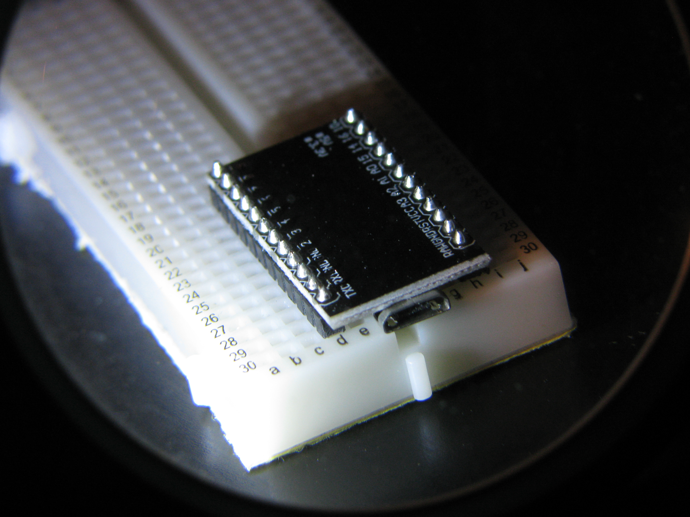

# micromeme

got this for around a dollar from aliexpress and didnt have any real usescases for it. so I made some useless projects, this repo is a collection of those. contains libs for uart and a basic usb keyboard interface for the atmega32u4.

## install
all these projects have their own make files for compiling and flashing, they all work the same.

to compile only: `make hex`

to compile, if needed, and flash it to the board: `make flash`, keep in mind you'll have reset the board for it accept being flashed

to clean compiled files:`make clean`

deps: avr-gcc, avrdude, make

### light activated nightmode
turn blue light filter and christmas lights on/off based on value light in the room, with ldr sensor

### nightmode switch
turn blue light filter and christmas lights on/off based on switch

### button login
one button tty login
